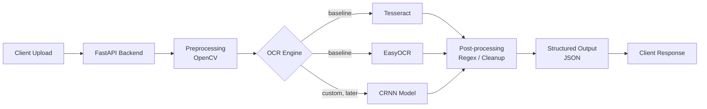
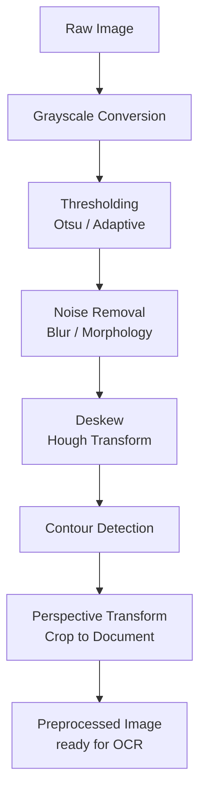
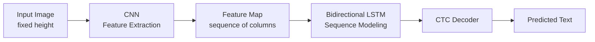
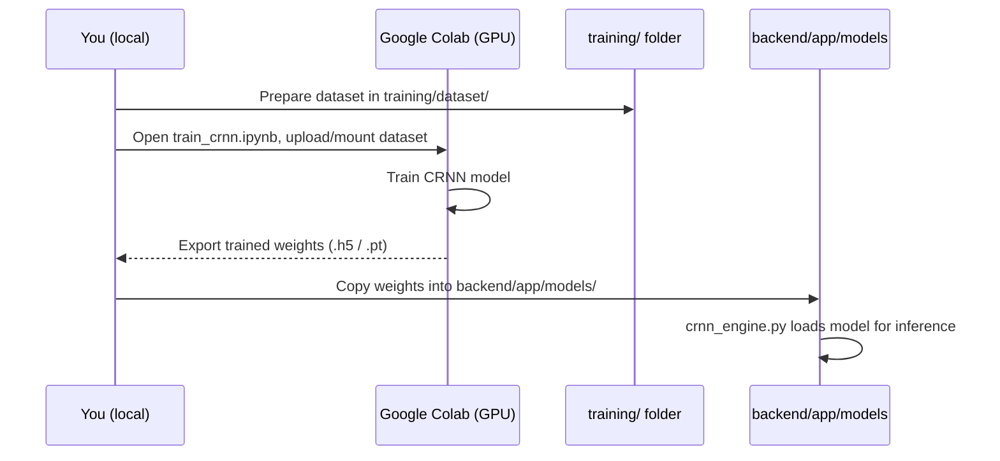
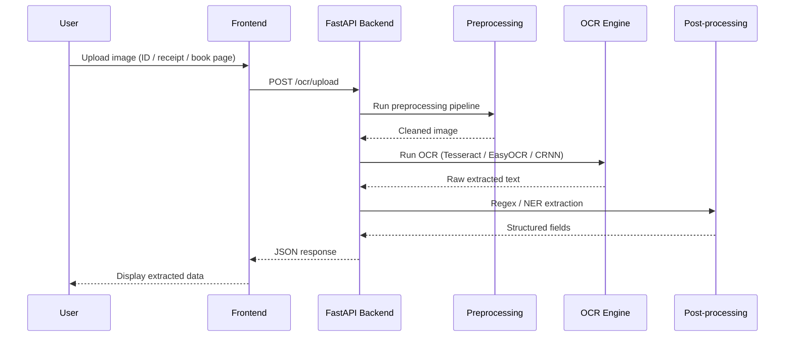

# OCR App — Learning Project

An app that extracts text from images (ID cards, receipts, books, documents) using classical CV preprocessing, OCR engines (Tesseract / EasyOCR), and a custom CRNN model trained on Google Colab.

This project is being built as a **learning exercise** — the goal is to understand each layer (preprocessing → OCR → post-processing) rather than just wire up a black-box pipeline.

---

## Project Status

- [ ] Preprocessing pipeline (OpenCV)
- [ ] Baseline OCR with Tesseract / EasyOCR
- [ ] Post-processing / structured field extraction
- [ ] Custom CRNN training (Colab)
- [ ] CRNN inference integrated into backend
- [ ] Frontend

---

## Architecture Overview



---

## Preprocessing Pipeline (Layer 2)



---

## CRNN Model Flow (Layer 4)



---

## Training Workflow (Colab-based)



---

## Request Flow (Runtime, once built)



---

## Folder Structure

```
ocr-app/
├── backend/            # FastAPI app: preprocessing, OCR engines, post-processing
├── frontend/            # UI (built later)
├── training/            # Colab notebooks + dataset, model export
├── sample_images/        # Test images: ids, receipts, books
├── docker-compose.yml
└── README.md
```

---

## Tech Stack

| Layer            | Tools                              |
|-------------------|-------------------------------------|
| Preprocessing      | OpenCV, Pillow                      |
| OCR (baseline)     | Tesseract, EasyOCR                   |
| OCR (custom)       | TensorFlow/Keras or PyTorch, CRNN, CTC loss |
| Post-processing     | Regex, spaCy (optional)               |
| Backend            | FastAPI, Uvicorn                     |
| Training           | Google Colab (GPU)                    |
| Deployment          | Docker, Docker Compose                |

---

## Running Locally

```bash
docker-compose up --build
```

Backend available at `http://localhost:8000`.
Health check: `GET /` → `{"status": "ok"}`

---

## Learning Notes

Research topics tracked as I go — see individual module docstrings and commit messages for what each piece does and why.