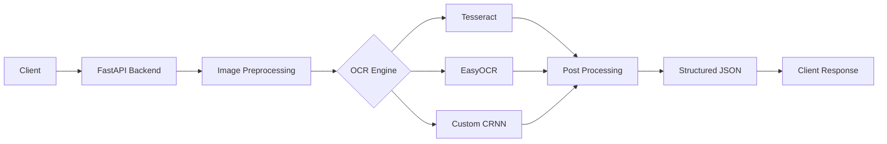
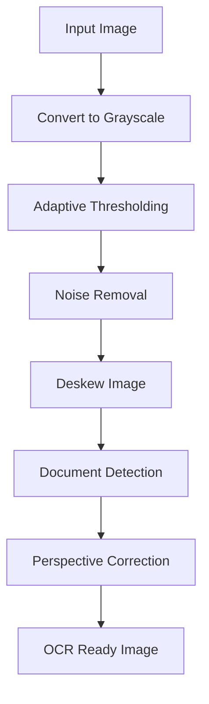
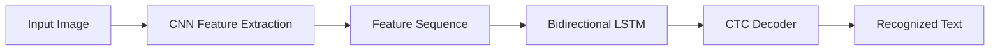
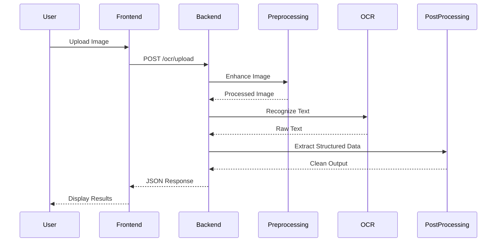
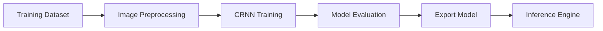

# OCR App

<div align="center">

# 📄 OCR App

### Production-Ready Optical Character Recognition Platform

Extract text and structured information from images and scanned documents using computer vision, deep learning, and intelligent post-processing.


</div>

---

## Overview

OCR App is a modular Optical Character Recognition (OCR) platform designed to transform images and scanned documents into clean, structured, machine-readable data.

The system combines classical computer vision techniques with modern deep learning models to deliver accurate text recognition across multiple document types. Its modular architecture enables different OCR engines to operate independently or together while exposing a unified API for seamless integration into other applications.

---

# Features

- Image enhancement and preprocessing
- Automatic document detection
- Perspective correction
- Deskewing
- Noise reduction
- Adaptive thresholding
- Multiple OCR engines
  - Tesseract
  - EasyOCR
  - Custom CRNN Model
- Structured data extraction
- RESTful API
- Dockerized deployment
- Modular and extensible architecture

---

# Supported Documents

- National IDs
- Passports
- Driver's Licenses
- Receipts
- Invoices
- Books
- Printed Documents
- Forms
- Business Cards
- Certificates

---

# Architecture



---

# Image Preprocessing Pipeline



---

# Deep Learning OCR Pipeline



---

# Runtime Request Flow



---

# Model Training Pipeline



---

# Project Structure

```text
ocr-app/
│
├── backend/
│   ├── app/
│   │   ├── api/
│   │   ├── preprocessing/
│   │   ├── engines/
│   │   ├── postprocessing/
│   │   ├── models/
│   │   ├── services/
│   │   └── main.py
│   │
│   ├── Dockerfile
│   └── requirements.txt
│
├── frontend/
│
├── training/
│   ├── dataset/
│   ├── notebooks/
│   ├── models/
│   └── scripts/
│
├── sample_images/
│
├── docker-compose.yml
├── .gitignore
└── README.md
```

---

# Technology Stack

| Layer | Technologies |
|---------|--------------|
| Backend | FastAPI, Uvicorn |
| Computer Vision | OpenCV, Pillow |
| OCR Engines | Tesseract, EasyOCR |
| Deep Learning | TensorFlow / Keras or PyTorch |
| Recognition Model | CRNN + CTC Loss |
| Information Extraction | Regex, spaCy |
| Deployment | Docker, Docker Compose |

---

# OCR Processing Pipeline

```text
Input Image
      │
      ▼
Image Enhancement
      │
      ▼
Document Detection
      │
      ▼
OCR Recognition
      │
      ▼
Post Processing
      │
      ▼
Structured Information
      │
      ▼
JSON Response
```

---

# API Endpoints

## Upload Image

```http
POST /ocr/upload
```

Uploads an image and returns structured OCR results.

---

## Health Check

```http
GET /
```

Response

```json
{
    "status": "ok"
}
```

---

# Example Response

```json
{
  "document_type": "receipt",
  "merchant": "Elite Supermarket",
  "date": "2026-07-20",
  "currency": "MWK",
  "total": 18500,
  "items": [
    {
      "name": "Bread",
      "price": 2500
    },
    {
      "name": "Milk",
      "price": 3000
    }
  ],
  "raw_text": "ELITE SUPERMARKET\nBread 2500\nMilk 3000\nTOTAL 18500"
}
```

---

# Getting Started

## Clone Repository

```bash
git clone https://github.com/yourusername/ocr-app.git
```

```bash
cd ocr-app
```

---

## Build Containers

```bash
docker compose up --build
```

Backend

```
http://localhost:8000
```

Interactive API Documentation

```
http://localhost:8000/docs
```

---

# Future Roadmap

- Handwritten Text Recognition
- PDF OCR
- Batch Processing
- Table Detection
- Layout Analysis
- Named Entity Recognition
- Key-Value Pair Extraction
- Multi-language OCR
- Confidence Score Visualization
- ONNX Runtime Optimization
- GPU Acceleration
- Document Classification

---

# Design Principles

The project is built around the following principles:

- Modular Architecture
- High Accuracy
- Scalability
- Maintainability
- Extensibility
- Production Readiness
- API First Design

---

# Vision

OCR App aims to provide a robust, scalable, and extensible OCR platform capable of transforming unstructured visual documents into structured, machine-readable information through the integration of computer vision, deep learning, and intelligent document understanding.

The architecture is designed to support future advancements in document AI while maintaining flexibility for integrating new recognition models, preprocessing techniques, and post-processing pipelines.

---

## License

This project is licensed under the MIT License.

---

<div align="center">

**Built with ❤️ using FastAPI, OpenCV, TensorFlow, and Docker.**

</div>